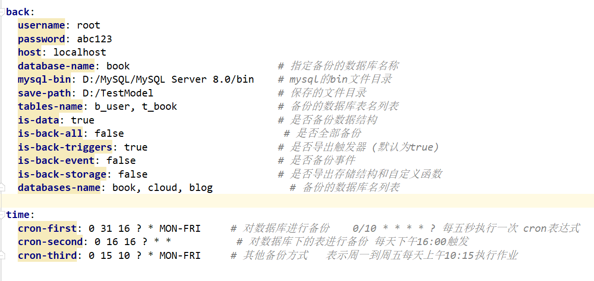

# mysql-back-java
 用java编写的备份数据库工具
 
# 基本功能
## BackUpUtils
 1. 备份所有数据库（数据可选）
 2. 选择备份数据库（数据可选）
 3. 备份数据库下的一张或多个表（数据可选）
 4. 备份存储结构和自定义函数
 5. 备份事件
--- 
## TimeTaskUtils
 1. 对数据库进行备份的定时任务
 2. 对数据库表进行备份的定时任务
---
 ## application.yml 配置文件
 
---
## MySQLUtils
 1. 查询所有数据库 
 2. 查询数据库对应的所有表
 3. 备份数据库，同时生成二进制文件
